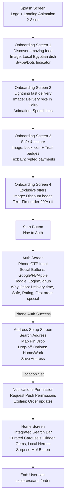
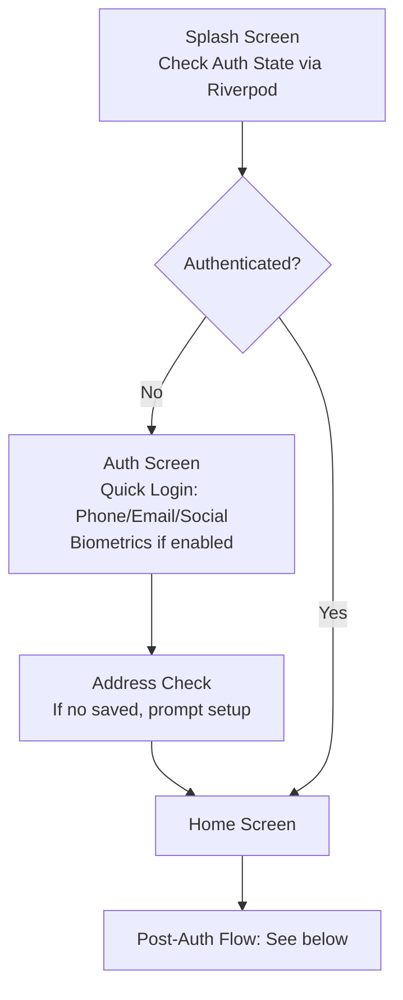
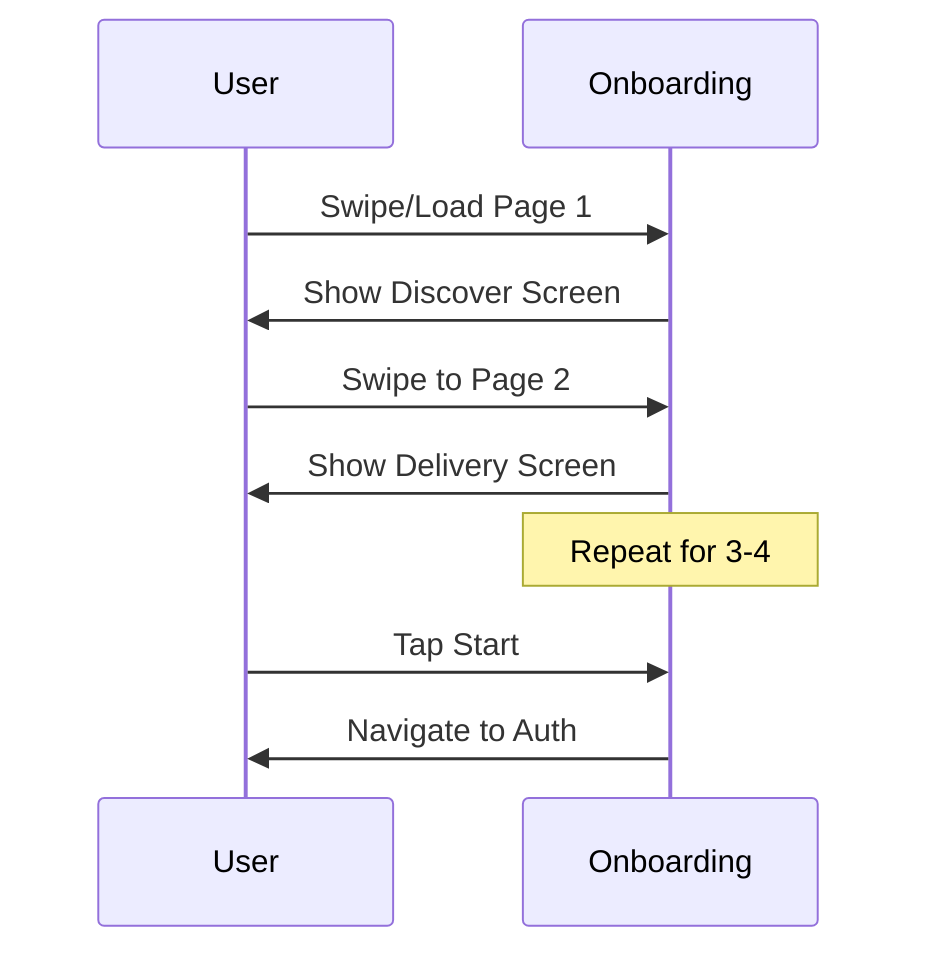
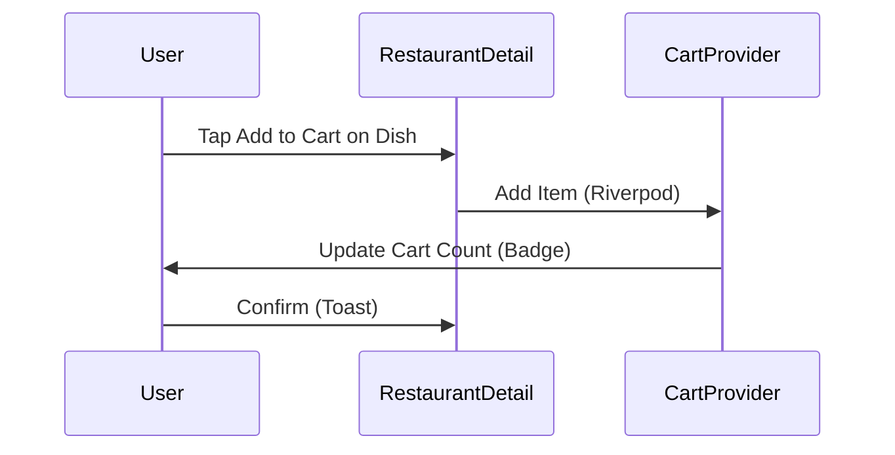

# Project Journal: Otlob App

This document records the architectural decisions, dependency choices, and the overall development journey of the Otlob food delivery app. It is intended to be a guide for developers and AI assistants working on this project.

## Project Overview

Otlob is a premium Flutter-based mobile application for discovering and ordering from Egypt's authentic local food scene.

## High-Level Architecture

The project follows a feature-first architecture, with a clear separation of concerns between the data, domain, and presentation layers.

*   **State Management:** We are using **`flutter_riverpod`** for state management. It was chosen for its compile-time safety, simplicity, and good integration with the Flutter ecosystem.
*   **Navigation:** We are using **`go_router`** for declarative routing.
*   **Networking:** We are using **`retrofit`** and **`dio`** for type-safe API calls.

## Dependency Decisions

The selection of dependencies has been a careful process, with a focus on choosing modern, well-maintained, and compatible packages.

### Local Database: The Journey to Drift

The choice of a local database involved a detailed investigation:

1.  **Initial consideration of Hive:** Hive was initially considered, but it was found to be largely unmaintained, with many open issues and a dependency on an old version of `source_gen` that caused conflicts with other packages.
2.  **Evaluation of Isar:** Isar, the successor to Hive, was then considered. However, we discovered that the original Isar repository is also not actively maintained, and there are concerns about its compatibility with upcoming Android versions. While a community fork exists, the situation created uncertainty.
3.  **Final Decision: Drift:** After careful consideration, we decided to use **Drift**. It is a powerful, mature, and actively maintained persistence library built on top of SQLite. It offers strong typing, powerful querying capabilities, and a clear migration path. This choice provides the best long-term stability and robustness for the project.

### Other Key Dependencies

*   **`app_links`:** Replaced the discontinued `uni_links` package for deep linking.
*   **`freezed`:** Used for creating immutable data models and unions, which works well with Riverpod and helps to ensure type safety.
*   **Code Generation Packages:** We have carefully selected a compatible set of versions for `build_runner`, `drift_dev`, `retrofit_generator`, and `json_serializable` to ensure that code generation works smoothly.

## Local Storage Strategy

This project uses a combination of local storage solutions for different purposes:

*   **Drift:** Used as the main local database for structured, relational data.
*   **flutter_secure_storage:** Used for storing sensitive data like authentication tokens.
*   **shared_preferences:** Used for simple key-value settings like theme preferences or feature flags.

## Implemented Services

The following core services have been implemented in `lib/core/services/`:

*   **`database.dart`:** The Drift database setup.
*   **`connectivity_service.dart`:** To check for internet connectivity.
*   **`permission_service.dart`:** To handle permissions for location, camera, etc.
*   **`persistent_provider.dart`:** A Riverpod provider for persisting the cart state using `shared_preferences`.
*   **`profile_image_picker.dart`:** A service for picking images from the gallery.

## 2025-10-01: Refactoring and Dependency Updates

*   Refactored `lib/core/providers/persistent_provider.dart` to use the new `AsyncNotifier` API from Riverpod 3.0. This resolves previous compilation errors and aligns the project with the latest Riverpod best practices.
*   Attempted to update all dependencies to their latest versions. Due to dependency conflicts, not all packages could be updated to the absolute latest. The dependencies have been updated to the latest compatible versions using `flutter pub upgrade`.

## Next Steps

The project is now in a good state to start building features. The next logical steps are:

*   Start building the UI for the home screen.
*   Create the `CartPage` UI and integrate it with the `persistentCartProvider`.
*   Set up the navigation with `go_router`.
*   Implement the authentication flow.

## 2025-09-30: Dependency Audit and Optimization

* Conducted a comprehensive review of all dependencies in pubspec.yaml using `flutter pub outdated`.
* Updated core dependencies to latest compatible versions: flutter_riverpod (^3.0.1), firebase_core (^4.1.1), firebase_auth (^6.1.0), cloud_firestore (^6.0.2), and others where possible without breaking compatibility.
* Resolved drift version conflict by downgrading to ^2.28.2 (from ^2.28.3) to ensure resolution with sqlite3_flutter_libs.
* Regenerated all code files with `build_runner build --delete-conflicting-outputs` after updates; no breaking changes detected.
* Verified project with `flutter analyze` - no issues found.
* Identified potential optimizations:
  - Maps: Both google_maps_flutter and mapbox_maps_flutter are declared but not imported; recommend removing mapbox_maps_flutter unless specific features needed to reduce bundle size.
  - Caching: dio_http_cache_lts (^0.4.2) is outdated; consider migrating to dio_cache_interceptor (^3.5.0) for better HTTP caching with ETag and offline support.
  - No major redundancies; stack aligns well with clean architecture and Firebase-first approach.
* Committed and pushed updates to main branch (commit e7c99f0).

## Next Steps

* Implement navigation with GoRouter and bottom navigation bar.
* Build HomeScreen with curated carousels ('Hidden Gems', 'Local Heroes') and 'Surprise Me!' feature.
* Integrate mock restaurant data via repository pattern.
* Develop search and filtering for discovery.

## 2025-09-30: Authentication System Planning

### Authentication System Overview
The authentication system provides secure user registration, login, and session management using Firebase Authentication. It supports email/password, Google sign-in, and optional phone authentication for Egypt's mobile-first users. The system follows clean architecture, integrating with Riverpod state management and GoRouter navigation.

### Key Goals
- Seamless, premium user experience with social/email sign-up/login.
- Offline support using Drift for local user data persistence.
- Route protection with authentication guards.
- User profile management post-login.
- Compliance with privacy standards for secure data handling.

### Features (MVP)
**Registration (Sign-up):**
- Email/password with validation (8+ chars, confirm match).
- Google sign-in for quick registration.
- Phone authentication (Firebase Phone Auth for OTP).
- Profile completion (name, optional phone).
- Terms acceptance checkbox.

**Login:**
- Email/password with "remember me" (secure token storage).
- Google sign-in.
- Phone login (OTP).
- "Forgot password" with email reset.

**Session Management:**
- Automatic token refresh via Firebase Auth state listeners.
- Logout (clear local data/tokens).
- Offline login using cached credentials.

**Error Handling:**
- Network errors (retry with backoff).
- Invalid credentials (friendly messages).
- Rate limiting ("Too many attempts").
- Validation errors (inline/form level).

**UI/UX:**
- Loading indicators.
- Success messages ("Welcome back!").
- Toggle between login/signup.
- Social proof ("Join 10k+ food lovers").

### Architecture
**Domain Layer:**
- Entities: `User` (id, email, name, phone, createdAt, isVerified).
- Repositories: `AuthRepository` (registerWithEmail, loginWithEmail, loginWithGoogle, logout, getCurrentUser, resetPassword).
- Use Cases: `RegisterUserUseCase`, `LoginUserUseCase`, `LogoutUseCase`.

**Data Layer:**
- Data Sources: `FirebaseAuthDataSource` (Firebase calls), `LocalAuthDataSource` (Drift caching).
- Repositories: `FirebaseAuthRepository` (combines sources, handles `Failure`).
- Models: `UserModel` (freezed for JSON).

**Presentation Layer:**
- Providers: `authProvider` (AsyncNotifier for auth state: loading/authenticated/unauthenticated).
- Screens: `LoginScreen`, `SignupScreen`, `AuthWrapper`.
- Widgets: Form fields, loading overlay, error banners.

**Integration:**
- Firebase: `firebase_auth` for auth, `cloud_firestore` for profiles.
- Local: Drift for user caching.
- Navigation: GoRouter redirect for guards.

### UI Flow
1. App starts at `/auth` (guarded).
2. AuthWrapper: If authenticated → `/home`; else → LoginScreen.
3. LoginScreen: Email/password form, Google button, "Forgot Password?", toggle to Signup.
4. SignupScreen: Email/password/confirm/name form, terms checkbox, Google button, toggle to Login.
5. Success: Save to local, navigate to `/home`, welcome toast.
6. Logout: Clear data, redirect to `/auth`.

### Firebase Integration
- Initialize in `main.dart`.
- Methods: `createUserWithEmailAndPassword`, `signInWithEmailAndPassword`, `signInWithCredential` (Google).
- Listener: `FirebaseAuth.instance.authStateChanges()` in provider.
- Profile: Save to Firestore `users` collection (doc ID = user UID).
- Security: HTTPS, Firebase rules for user-specific access.

### Error Handling & Edge Cases
- Map Firebase exceptions to `AuthFailure` (e.g., `emailAlreadyInUse`, `networkError`).
- Offline: Use `connectivity_plus`; fallback to cached login.
- Validation: Client + server-side.
- Loading: AsyncValue in Riverpod.
- Edge: Weak password, invalid email, timeout, locked account.

### Navigation Guards
- GoRouter `redirect`: Unauthenticated on protected routes → `/auth`; authenticated on `/auth` → `/home`.
- Protected: `/home`, `/cart`, `/profile`.
- Deep links: Handle email verification.

### Testing & Security
- Unit: Mock repositories (mockito).
- Integration: Firebase emulator.
- Security: No local passwords; secure storage for tokens; input validation.

### Implementation Timeline
- Week 1: Domain/Use Cases, Repository.
- Week 2: Data sources, providers.
- Week 3: UI, integration, testing.

This plan ensures a robust auth system scalable to .NET backend transition.

## App Flow Plan (2025-10-01)

### User Flows

The app flows are designed for a premium, intuitive experience, emphasizing discovery of authentic Egyptian food. Flows incorporate onboarding for first-time users, quick access for returning users, and seamless post-auth navigation. All flows start from the Splash screen and use animations (e.g., Lottie or Flutter animations) for smooth transitions. Shimmer loading is used for data fetches.

#### First-Time User Flow
This flow guides new users through discovery of Otlob's value proposition, authentication, and setup to reach the Home screen quickly.



- **Key Notes:** Onboarding uses PageView with dots and swipe gestures. Auth includes forgot password flow (email reset). If social auth chosen, skip phone OTP. Address uses Google Maps API for search/pin. Notifications via permission_handler.

#### Returning User Flow
Returning users bypass onboarding for efficiency, with auth check to ensure session validity.



- **Key Notes:** Use Firebase Auth state listener in main.dart for instant redirect. If token expired, prompt re-auth. Offline support: Check local Drift cache for user data.

#### Post-Auth Flows
After reaching Home, users engage in discovery, ordering, and management. Key sub-flows include search-to-order, subscription, and post-order review.

```mermaid
flowchart TD
    A[Home Screen<br/>Bottom Nav: Home (active)] --> B[Search in Home Bar<br/>Filter: Categories, Price, Rating]
    B --> C[Restaurant Detail Screen<br/>Menu Categories<br/>Add to Cart<br/>Tawseya Vote Button (1/month)<br/>Reviews Section]
    C --> D[Cart Screen<br/>Bottom Nav: Cart<br/>Items, Subtotal, Special Instructions<br/>Checkout Button]
    D --> E[Checkout Flow<br/>Address Confirm<br/>Payment: COD/Digital (Paymob)<br/>Order Confirmation]
    E --> F[Order Tracking Screen<br/>Live Status: Preparing, Out for Delivery<br/>ETA]
    F --> G[Delivery Complete<br/>Review/Rating Screen<br/>Dual Rating: Food/Delivery<br/>Tawseya if eligible]
    G --> H[Profile Screen<br/>Bottom Nav: Profile<br/>Orders History, Favorites, Settings<br/>DashPass Subscription Toggle]
    
    A --> I[Favorites Screen<br/>Bottom Nav: Favorites<br/>Saved Restaurants/Dishes<br/>Reorder Button]
    H --> J[DashPass Subscription<br/>Benefits: Free delivery, Exclusive deals<br/>Monthly/Yearly<br/>Payment Integration]
    
    subgraph "Post-Order"
    G
    end
    
    subgraph "Discovery"
    B --> C
    end
```

- **Key Notes:** Tawseya voting: Limited to 1 per user/month, stored in Firestore/Drift. DashPass: Subscription model like DoorDash Pass, with UI toggle leading to payment. Reviews: Post-delivery prompt via notification.

### Screen Breakdown

This section details all key screens, including text-based wireframes (ASCII art for layout), reusable components, and Mermaid for complex interactions. UI is responsive using ScreenUtil, Material 3 design (elevated cards, dynamic colors), and animations (Hero, FadeTransition).

#### List of Screens
1. **Splash**: Logo, loading spinner.
2. **Onboarding**: 4 paginated screens with images/text.
3. **Auth**: Unified login/signup with social options.
4. **Address Setup**: Map-based input.
5. **Notifications Permission**: Simple modal/prompt.
6. **Home**: Feed with search, carousels.
7. **Search**: Integrated in Home (no separate screen).
8. **Restaurant Detail**: Menu, reviews, vote.
9. **Cart**: Item list, checkout.
10. **Favorites**: Saved items list.
11. **Profile**: User info, orders, settings, subscription.
12. **Review/Rating**: Post-order modal/full screen.
13. **Order Tracking**: Real-time status.
14. **Checkout**: Payment/address confirm.

#### Detailed Breakdown with Wireframes
**Onboarding Screen (Example for Screen 1)**  
Reusable Components: AppBar (none), PageIndicator (dots), CustomButton (Start), ImageCarousel.  
Animation: Slide transition between pages.

Text Wireframe:
```
+---------------------------+
|                           |
|  [Image: Egyptian Food]   |
|                           |
|  Discover amazing food    |
|  from local heroes!       |
|                           |
|  [Dots: o-- -- --]        |
|                           |
|         [Next Button]     |
+---------------------------+
```

Mermaid for Onboarding Flow:


**Home Screen**  
Components: SearchBar (integrated), CarouselWidget (Shimmer-loaded), RestaurantCard (image, name, rating, Tawseya count), SurpriseMeButton.  
Animation: Staggered list animation on load.

Text Wireframe:
```
+---------------------------------+
| [Search Bar: Type to search]    |
|                                 |
| Hidden Gems Carousel            |
| [Card1] [Card2] [Card3] ...     |
|                                 |
| Local Heroes                    |
| [Card4] [Card5] ...             |
|                                 |
| [Surprise Me! Button]           |
|                                 |
| Bottom Nav: Home Fav Cart Prof  |
+---------------------------------+
```

**Auth Screen**  
Components: ToggleSwitch (Login/Signup), PhoneInputField, SocialButton (Google/FB/Apple), WhyOtlobSection (icons: clock, shield, star, discount).  
Animation: Form validation shake.

Text Wireframe:
```
+---------------------------+
| Login / Signup Toggle     |
|                           |
| Enter Phone: +20 ___ ___  |
| [Send OTP Button]         |
|                           |
| -- OR --                  |
| [Google] [FB] [Apple]     |
|                           |
| Why Otlob?                |
| Delivery: 30min | Safe ✓  |
| Rating: 4.8 | 20% Off     |
+---------------------------+
```

**Restaurant Detail Screen**  
Components: MenuCategoryTab, DishCard (add to cart), ReviewList, TawseyaButton (vote if available).  
Mermaid for Add to Cart:


**Cart Screen**  
Components: CartItemTile (quantity +/-, notes), SubtotalCard, CheckoutButton.  
Text Wireframe:
```
+---------------------------+
| Cart Items                |
| - Koshari x2  E£50        |
|   [ - ] [ 2 ] [ + ] Notes |
| Subtotal: E£100           |
| Delivery: E£20            |
| Total: E£120              |
|                           |
| [Checkout Button]         |
+---------------------------+
```

**Review Screen**  
Components: StarRating (food/delivery separate), TextReviewField, SubmitButton.  
Post-order modal.

**Other Screens (Summary):**
- **Address**: GoogleMapWidget, SearchField, SaveButton. Wireframe: Map view with pin, address form below.
- **Favorites**: ListView of RestaurantCard, ReorderButton.
- **Profile**: Sections: Edit Profile (name, phone, image), Orders List, Settings (language, notifications), DashPass Toggle.
- **Order Tracking**: TimelineWidget (preparing -> out -> delivered), ETA Counter.
- **Notifications Permission**: AlertDialog with ExplainText, Allow/Deny buttons.

All screens use Material 3: Rounded corners, elevation, dynamic theming. Responsive: ScreenUtil for padding/margins based on device size/orientation.

### Navigation Structure

Navigation uses GoRouter for declarative routes, with bottom navigation bar for main tabs. Auth guards redirect unauthenticated users to /auth. Deep linking for order tracking/sharing.

#### Routes
- `/`: Redirect to /splash
- `/splash`: SplashScreen (initial, auto-redirect)
- `/onboarding`: OnboardingScreen (first-time only, check local flag)
- `/auth`: AuthScreen (login/signup)
- `/address`: AddressSetupScreen (post-auth if needed)
- `/notifications`: NotificationsPermissionScreen (one-time)
- `/home`: HomeScreen (default tab)
- `/favorites`: FavoritesScreen
- `/cart`: CartScreen
- `/profile`: ProfileScreen
- `/restaurant/:id`: RestaurantDetailScreen
- `/checkout`: CheckoutScreen
- `/tracking/:orderId`: OrderTrackingScreen
- `/review/:orderId`: ReviewScreen
- `/subscription`: DashPassSubscriptionScreen (from profile)

#### Bottom Navigation
Persistent Scaffold with 4 tabs: Home (search/feed), Favorites (saved), Cart (badge count), Profile (settings/subscription). Index managed by Riverpod state.

#### Guards
- Auth Guard: For /home, /favorites, /cart, /profile, /restaurant/*, /checkout, etc. Redirect to /auth if !authProvider.isAuthenticated.
- Onboarding Guard: If first-time (local storage flag), redirect to /onboarding after splash.
- Location Guard: Post-auth, if no address, redirect to /address.

Mermaid Navigation Tree:
```mermaid
graph TD
    Start[App Start] --> Splash[/splash]
    Splash --> AuthCheck{Auth?}
    AuthCheck -->|No| Auth[/auth]
    Auth --> AddressCheck{Address Set?}
    AddressCheck -->|No| Address[/address]
    Address --> NotifCheck{Notifs?}
    NotifCheck -->|No| Notifs[/notifications]
    NotifCheck -->|Yes| Home[/home]
    AuthCheck -->|Yes| Home
    Home --> BottomNav[Bottom Nav Bar]
    BottomNav --> HomeTab[Home<br/>Search + Carousels]
    BottomNav --> FavTab[Favorites<br/>Saved List]
    BottomNav --> CartTab[Cart<br/>Items + Checkout]
    BottomNav --> ProfTab[Profile<br/>Orders + Settings]
    HomeTab --> RestDetail[/restaurant/:id]
    CartTab --> Checkout[/checkout]
    Checkout --> Tracking[/tracking/:orderId]
    Tracking --> Review[/review/:orderId]
    ProfTab --> Sub[/subscription]
    RestDetail --> TawseyaVote[Vote Action]
    style Splash fill:#f9f
    style Auth fill:#ff9
    style Home fill:#9f9
```

- **Key Notes:** Use GoRouter's redirect callback with authProvider.watch(). ShellRoute for bottom nav to persist tabs. Error handling: 404 to Home. RTL support: Directionality widget with easy_localization.

### Branding & Assets

Branding emphasizes premium, authentic Egyptian feel: Deep blues for trust, vibrant red accents for energy, clean typography.

#### Colors
From app_theme.dart:
- Primary: 0xFF2B3A67 (navy blue for backgrounds, buttons)
- Secondary: 0xFFE84545 (red for accents, CTAs like Add to Cart)
- Others: Surface (white/off-white), Error (red), Success (green), OnPrimary (white)
Material 3 dynamic colors for light/dark mode.

#### Fonts
- Primary: Tutano.cc (tutano_cc_v2.ttf) for logo, titles, headings (bold, italic variants). Load via pubspec assets/fonts/.
- Body: Google Fonts Roboto or Noto Sans Arabic for readability.
- RTL Support: easy_localization package for Arabic/English switching. Use TextDirection.rtl for Arabic.

#### Assets Needed
- **Fonts:** tutano_cc_v2.ttf (already in assets/fonts? Confirm).
- **Images/Icons:**
  - Logo: Otlob logo (SVG/PNG, various sizes for splash/app icon).
  - Onboarding: 4 high-res images (Discover: Plate of koshari; Delivery: Bike in streets; Secure: Shield; Offers: Discount tag). Source: Stock or generate AI (e.g., Midjourney for Egyptian theme).
  - Restaurant: Mock images for 20+ local spots (e.g., falafel, molokhia). Need placeholders in assets/images/restaurants/.
  - Icons: Custom SVG for Tawseya (vote hand), DashPass (shield with star), categories (Egyptian dishes).
  - Misc: Map pins, loading Shimmer gradients, receipt templates (for PDF gen).
- **Animations:** Lottie files for splash (food swirl), onboarding transitions.
- **Other:** Splash background gradient, bottom nav icons (home, heart, bag, user).

All assets in assets/images/, icons/. Optimize with flutter_image_resizer. For production, ensure cultural sensitivity (no pork/alcohol imagery).

### Integration Points

The app integrates external services for core functionality, starting with mocks/local, transitioning to Firebase, then .NET API. Use clean arch: Repos abstract sources.

#### Authentication
- **Current:** Firebase Auth (phone OTP, Google, FB, Apple sign-in). Use firebase_auth package. Phone: Verify OTP via SMS (Egypt +20). Social: OAuth credentials.
- **Flow:** As in auth planning. Forgot password: Email link via Firebase.
- **Local:** Cache user in Drift (user table).
- **Future:** .NET JWT tokens, repo switch.
- **Security:** No plain passwords local; use secure_storage.

#### Location & Address
- **Services:** google_maps_flutter for map view/pin drop. geolocator for GPS detection.
- **Flow:** Auto-detect on first auth, manual search via Google Places API (need API key).
- **Storage:** Save addresses in Drift (addresses table: id, user_id, label, lat/lng, details).
- **Integration:** Permission via permission_service. Offline: Cache recent locations.
- **Future:** .NET API for address validation.

#### Notifications
- **Push:** firebase_messaging for order updates (preparing, delivered). Request permission post-address.
- **Local:** flutter_local_notifications for in-app alerts (e.g., cart reminder).
- **Flow:** Permission screen after address. Topics: User-specific (orderId).
- **Integration:** Handle background messages in main.dart. Permissions: permission_handler.
- **Future:** .NET push via FCM or custom.

#### Other Integrations
- **Payments:** Paymob for digital (post-MVP, but plan for checkout). COD default.
- **Tawseya Voting:** Firestore collection (votes: user_id, restaurant_id, month). Limit 1/month via query.
- **Subscription (DashPass):** Stripe or Paymob recurring. UI toggle → payment screen.
- **Reviews:** Post to Firestore (reviews collection). Dual rating: food_score, delivery_score.
- **Search/Categories:** Algolia or Firestore queries (mock initially).
- **Offline:** Drift sync on reconnect (connectivity_service).
- **Analytics:** Firebase Analytics for flows (e.g., onboarding completion).

All integrations guarded by feature flags (shared_preferences). Error handling: Custom failures, user-friendly toasts. Testing: Mock repos for unit, Firebase emulator for integration.

This plan provides a comprehensive blueprint for the Otlob app flow, ensuring a premium, user-centric experience aligned with the project brief.