# Otlob UI/UX Specification
**Version:** 2.0  
**Date:** October 4, 2025  
**Platform:** Flutter Mobile App (iOS & Android)

---

## Section 1: Introduction

This document defines the user experience goals, information architecture, user flows, and visual design specifications for Otlob's user interface. It serves as the complete UX blueprint for frontend development, ensuring a cohesive and user-centered experience.

### Overall UX Goals & Principles

#### Target User Persona: "Sara, the Urban Explorer"

**Demographics:**
- Age: 28 years old
- Location: Cairo, Egypt (urban environment)
- Occupation: Tech-savvy professional
- Income: Disposable income for quality food experiences
- Education: Well-educated, values authenticity

**Psychographics:**
- Values authentic experiences over mass-market options
- Skeptical of fake reviews and paid promotions
- Time-poor but food-curious
- Wants to support local businesses
- Seeks community connection through shared experiences

**Behaviors:**
- Regularly uses food delivery apps (2-3 times/week)
- Actively researches restaurants before ordering
- Shares food experiences on social media
- Willing to try new places if trusted source recommends
- Frustrated by choice paralysis on existing apps

**Pain Points:**
- Can't distinguish authentic recommendations from paid ads
- Overwhelmed by too many generic options
- Tired of international chains dominating search results
- Doesn't trust star ratings (suspects manipulation)
- Hard to discover hidden local gems

**Goals:**
- Feel like a food insider who knows the city's secrets
- Enjoy variety without spending hours researching
- Support local businesses and community
- Have a premium, delightful ordering experience
- Trust recommendations from real community members

#### Usability Goals

1. **Effortless Onboarding**
   - New user can sign up and start browsing in < 2 minutes
   - Clear value proposition on first screens
   - Optional skip ("guest mode") for instant access

2. **Frictionless Ordering**
   - Returning user can reorder favorite dish in < 60 seconds
   - Cart persists across sessions
   - One-tap reorder from history

3. **Joyful Discovery**
   - Users feel delight and surprise using discovery features
   - "Surprise Me!" and curated carousels provide serendipity
   - Visual design celebrates food as hero

#### Core Design Principles

1. **Visually Appetizing**
   - High-quality food photography is paramount
   - Clean layouts that don't compete with food imagery
   - Generous whitespace to avoid cluttered feeling
   - Beautiful typography that's easy to read

2. **Effortless & Intuitive**
   - Navigation should be "invisible" - users don't think about it
   - Progressive disclosure (show simple first, details on demand)
   - Familiar patterns (Material Design 3)
   - Clear affordances (buttons look tappable)

3. **Trust Through Transparency**
   - Clear, honest information (no hidden fees)
   - Separate food and delivery ratings (dual-rating system)
   - Professional presentation (styled receipts, order tracking)
   - Community-driven endorsements (Tawseya system)

4. **Delight in the Details**
   - Thoughtful micro-interactions and animations
   - Smooth transitions between screens
   - Playful touches that surprise users
   - Premium feel in every interaction

### Change Log

| Date | Version | Description | Author |
|------|---------|-------------|--------|
| Sep 26, 2025 | 1.0 | Initial UI/UX specification | UX Team |
| Oct 4, 2025 | 2.0 | Updated for current implementation | AI Agent |

---

## Section 2: Information Architecture (IA)

### Site Map / Screen Hierarchy


### Navigation Structure

#### Primary Navigation (Bottom Tab Bar)
Always visible on main screens. 4 tabs:

1. **Home (Discover)** 🏠
   - Default landing screen
   - Curated carousels + restaurant list
   - "Surprise Me!" button

2. **Search** 🔍
   - Dedicated search interface
   - Filters (cuisine, rating, delivery time)
   - Recent searches

3. **Orders** 📦
   - Active orders (with live tracking)
   - Past orders (with reorder button)
   - Empty state for first-time users

4. **Profile** 👤
   - User info
   - Favorites
   - Addresses
   - Settings

#### Secondary Navigation
- **Back Button:** Always in AppBar on secondary screens
- **Context Actions:** Inline buttons (e.g., "Add to Cart", "Favorite")
- **Deep Links:** Direct navigation to specific restaurants/dishes

#### Breadcrumb Strategy
No traditional breadcrumbs (mobile app pattern). Context maintained through:
- Clear screen titles in AppBar
- Hierarchical navigation stack
- Visual continuity (hero animations)

---

## Section 3: User Flows

### Flow 1: First-Time User Experience (FTUE)

**User Goal:** Understand what Otlob offers and start browsing restaurants.

**Entry Point:** App launch (first time)

**Success Criteria:** User understands Otlob's value prop and can browse content.

**Flow Diagram:**


**Key Screens:**
1. **Splash (2 seconds):** Animated Otlob logo
2. **Onboarding (4 screens):** Swipeable intro with:
   - Screen 1: Hero image + "Your Personal Food Concierge"
   - Screen 2: Curated discovery features
   - Screen 3: Tawseya recommendation system
   - Screen 4: Support local restaurants
3. **Login/Signup:** Clean forms with social login options + "Skip" button

---

### Flow 2: Order Placement (Complete Journey)

**User Goal:** Discover a restaurant, choose a meal, and successfully place an order.

**Entry Points:** 
- Home screen carousel
- Search results
- "Surprise Me!" button

**Success Criteria:** User receives order confirmation and can track delivery.

**Flow Diagram:**


**Key Screens:**
1. **Restaurant Detail:** Menu, reviews, info, Tawseya button
2. **Dish Detail Modal:** Image, description, price, customization
3. **Cart:** Item list, price breakdown, checkout button
4. **Checkout:** Address confirmation, payment selection
5. **Order Confirmation:** Receipt, tracking link
6. **Order Tracking:** Live status updates

---

### Flow 3: Favoriting & Tawseya

**User Goal:** Save favorite dishes/restaurants and award monthly Tawseya endorsement.

**Entry Points:**
- Restaurant detail screen
- Dish detail modal
- Menu items

**Success Criteria:** Item saved to favorites, Tawseya vote recorded.

**Flow Diagram:**


**Key Interactions:**
- **Favorite:** Heart icon outline → filled with subtle scale animation
- **Tawseya:** Star icon with count badge, celebratory confetti animation

---

### Flow 4: Reorder from History

**User Goal:** Quickly reorder a past meal without re-browsing menu.

**Entry Points:**
- Orders tab → Order history
- Profile → Order history

**Success Criteria:** Previous order recreated in cart, ready for checkout.

**Flow Diagram:**


**Key Screens:**
- **Order History:** List with date, restaurant, total, status
- **Order Detail Modal:** Full order breakdown, receipt download, reorder button
- **Reorder Confirmation:** Shows which items added to cart

---

### Flow 5: "Surprise Me!" Feature

**User Goal:** Get a quick, fun restaurant recommendation without browsing.

**Entry Points:**
- Home screen header (lightning bolt icon)

**Success Criteria:** User sees single restaurant recommendation with explanation.

**Flow Diagram:**


```mermaid
graph TD
    A[Home Screen] --> B[Tap Surprise Me! Button]
    B --> C[Fun Loading Animation]
    C --> D[Random Restaurant Selected]
    D --> E[Restaurant Card Revealed]
    
    E --> F[Why This Restaurant? Explanation]
    F --> G{User Action}
    
    G -- View Restaurant --> H[Restaurant Detail Screen]
    G -- Not Interested → Try Again --> B
    G -- Dismiss --> A
```

**Key Design Elements:**
- **Button:** Playful lightning bolt icon in AppBar
- **Loading:** 1-2 second animation (slot machine or card flip)
- **Result:** Large card with restaurant image, name, cuisine, Tawseya count
- **Explanation:** "Based on your love for Egyptian cuisine" or "Local Hero with 47 Tawseyas"

---

## Section 4: Key Screen Wireframes

### Screen: Splash Screen

**Purpose:** Brand introduction while app initializes.

**Duration:** 2 seconds

**Layout:**
```
┌─────────────────────┐
│                     │
│                     │
│     [Otlob Logo]    │ ← Animated entrance
│     [Tagline]       │
│                     │
│                     │
└─────────────────────┘
```

**Elements:**
- Centered Otlob logo (animated fade-in + scale)
- Tagline: "Discover Authentic Egyptian Food"
- Background: Gradient or solid brand color

---

### Screen: Home Screen (Main Discovery)

**Purpose:** Primary discovery interface. Users browse curated content and restaurant listings.

**Layout:**
```
┌─────────────────────┐ AppBar
│ 📍 Cairo  [⚡ Surprise Me!] │
│ [Search Bar]         │
├─────────────────────┤
│ 🎯 Hidden Gems       │ Carousel 1
│ [→ → → → → → →]     │ Horizontal scroll
├─────────────────────┤
│ ⭐ Local Heroes      │ Carousel 2
│ [→ → → → → → →]     │
├─────────────────────┤
│ Restaurants Near You │ Main List
│ ┌─────────────────┐ │
│ │ [Image] Rest. 1 │ │ ← Restaurant Card
│ │ 4.5★ | 30 min   │ │
│ └─────────────────┘ │
│ ┌─────────────────┐ │
│ │ [Image] Rest. 2 │ │
│ │ 4.8★ | 25 min   │ │
│ └─────────────────┘ │
│                     │
└─────────────────────┘
[🏠 Discover] [🔍] [📦] [👤] ← Bottom Nav
```

**Key Elements:**
- **Location Selector:** Tap to change delivery address
- **Surprise Me! Button:** Fun, prominent in AppBar
- **Search Bar:** Always visible for quick access
- **Curated Carousels:** 
  - Hidden Gems: Lesser-known quality restaurants
  - Local Heroes: Top Tawseya recipients
- **Restaurant Cards:** Image, name, rating, delivery time, favorite icon
- **Bottom Navigation:** 4 tabs (Home, Search, Orders, Profile)

---

### Screen: Restaurant Detail

**Purpose:** Display comprehensive restaurant information and menu.

**Layout:**
```
┌─────────────────────┐
│ ← [Back]  [♥ Share] │ AppBar
├─────────────────────┤
│ [Header Image]       │ Hero image
│                      │
├─────────────────────┤
│ Restaurant Name      │ Info Section
│ ⭐ Food: 4.8 🚚: 4.2 │ Dual rating
│ 🎖️ 47 Tawseyas      │ Tawseya count
│ [Give Tawseya]       │ CTA button
├─────────────────────┤
│ [Menu] [Reviews]     │ Tabs
├─────────────────────┤
│ Appetizers ▼         │ Menu Category
│ ┌─────────────────┐ │
│ │ [Img] Dish 1    │ │ Menu Item
│ │ Description     │ │
│ │ 45 EGP    [+]   │ │
│ └─────────────────┘ │
│ ┌─────────────────┐ │
│ │ [Img] Dish 2    │ │
│ │ Description     │ │
│ │ 60 EGP    [+]   │ │
│ └─────────────────┘ │
│                     │
│ Main Courses ▼      │
│ ...                 │
└─────────────────────┘
```

**Key Elements:**
- **Hero Image:** Full-width restaurant photo
- **Dual Rating:** Separate stars for food and delivery
- **Tawseya Section:** Prominent display + "Give Tawseya" button
- **Tabs:** Switch between Menu and Reviews
- **Menu Categories:** Collapsible sections
- **Menu Items:** Image, name, description, price, add button
- **Floating Cart Button:** (if items in cart) Shows item count + total

---

### Screen: Dish Detail Modal

**Purpose:** Show detailed dish information with customization options.

**Layout:**
```
┌─────────────────────┐
│ [Dish Image]         │ Full-width
│                      │
├─────────────────────┤
│ Dish Name            │
│ ♥ 124 favorites      │
│                      │
│ Description text...  │
│                      │
│ Ingredients:         │
│ • Ingredient 1       │
│ • Ingredient 2       │
│                      │
│ Special Instructions │
│ ┌─────────────────┐ │
│ │ [Text Input]    │ │
│ └─────────────────┘ │
│                      │
│ Quantity: [- 1 +]    │
│                      │
│ ┌─────────────────┐ │
│ │ Add to Cart     │ │ CTA Button
│ │ 45 EGP          │ │
│ └─────────────────┘ │
└─────────────────────┘
```

**Key Elements:**
- **Dish Image:** Hero image (swipeable if multiple images)
- **Favorite Count:** Social proof
- **Detailed Description:** Full text
- **Ingredients:** Bulleted list
- **Special Instructions:** Free text input
- **Quantity Selector:** +/- buttons
- **Add to Cart:** Large CTA with price
- **Share Button:** (in AppBar)

---

### Screen: Cart

**Purpose:** Review order before checkout, modify items.

**Layout:**
```
┌─────────────────────┐
│ ← Cart              │ AppBar
├─────────────────────┤
│ Restaurant Name      │
│ ┌─────────────────┐ │
│ │ [Img] Dish 1    │ │ Cart Item
│ │ 45 EGP          │ │
│ │ [- 2 +]  [🗑️]   │ │ Quantity + Delete
│ └─────────────────┘ │
│ ┌─────────────────┐ │
│ │ [Img] Dish 2    │ │
│ │ 60 EGP          │ │
│ │ [- 1 +]  [🗑️]   │ │
│ └─────────────────┘ │
├─────────────────────┤
│ Delivery Instructions│
│ ┌─────────────────┐ │
│ │ [Text Input]    │ │
│ └─────────────────┘ │
├─────────────────────┤
│ Price Breakdown      │ Summary Section
│ Subtotal: 105 EGP    │
│ Delivery: 15 EGP     │
│ Service: 5 EGP       │
│ ─────────────────    │
│ Total: 125 EGP       │
├─────────────────────┤
│ ┌─────────────────┐ │
│ │ Proceed to      │ │ CTA Button
│ │ Checkout        │ │
│ └─────────────────┘ │
└─────────────────────┘
```

**Key Elements:**
- **Restaurant Header:** Shows which restaurant (if mixed cart, show warning)
- **Cart Items:** Image, name, price, quantity controls, delete
- **Delivery Instructions:** Optional text input
- **Price Breakdown:** Transparent cost display
- **Total:** Prominent display
- **Proceed Button:** Large, fixed at bottom

---

### Screen: Checkout (Guest Blocker)

**Purpose:** Require authentication before order placement.

**Layout (Guest User):**
```
┌─────────────────────┐
│ Checkout Blocked     │
├─────────────────────┤
│ [Lock Icon]          │
│                      │
│ Sign In Required     │
│                      │
│ Create an account or │
│ sign in to complete  │
│ your order.          │
│                      │
│ ┌─────────────────┐ │
│ │ Log In          │ │ Primary CTA
│ └─────────────────┘ │
│ ┌─────────────────┐ │
│ │ Sign Up         │ │ Secondary CTA
│ └─────────────────┘ │
│                      │
│ [Go Back to Cart]    │ Text button
└─────────────────────┘
```

**Layout (Authenticated User):**
```
┌─────────────────────┐
│ ← Checkout          │ AppBar
├─────────────────────┤
│ Delivery Address     │
│ ┌─────────────────┐ │
│ │ 123 Main St     │ │ Selected Address
│ │ Cairo, Egypt    │ │
│ │ [Change]        │ │
│ └─────────────────┘ │
├─────────────────────┤
│ Payment Method       │
│ ○ Cash on Delivery   │ Radio buttons
│ ○ Credit Card        │
│ ○ Digital Wallet     │
├─────────────────────┤
│ Order Summary        │
│ [Mini Cart View]     │
│ Total: 125 EGP       │
├─────────────────────┤
│ ┌─────────────────┐ │
│ │ Place Order     │ │ CTA Button
│ └─────────────────┘ │
└─────────────────────┘
```

---

### Screen: Order Tracking

**Purpose:** Show live order status with estimated delivery time.

**Layout:**
```
┌─────────────────────┐
│ ← Order #12345      │ AppBar
├─────────────────────┤
│ [Progress Indicator] │ Visual timeline
│ ● Placed             │ ✅ Completed
│ │                    │
│ ● Accepted           │ ✅ Completed
│ │                    │
│ ● Preparing          │ ⏳ In Progress
│ │                    │
│ ○ Out for Delivery   │ ⏸️ Pending
│ │                    │
│ ○ Delivered          │ ⏸️ Pending
│                      │
├─────────────────────┤
│ Estimated Time       │
│ 25-30 minutes        │
│                      │
│ Restaurant: Name     │
│ Driver: [Assigned]   │
│                      │
│ [Call Restaurant]    │ Action Buttons
│ [Call Driver]        │
│                      │
├─────────────────────┤
│ Order Items          │ Collapsible
│ [Mini Order Summary] │
└─────────────────────┘
```

**Key Elements:**
- **Progress Timeline:** Visual status with icons
- **Estimated Time:** Dynamic countdown
- **Contact Buttons:** Call restaurant or driver
- **Order Summary:** Collapsible section

---

## Section 5: Component Library

### Design System Approach

We use **Material Design 3** as foundation with custom Otlob brand theme.

### Core Components

#### 1. Restaurant Card

**Variants:**
- **Horizontal (List):** Used in main restaurant list
- **Vertical (Carousel):** Used in curated carousels

**Anatomy:**
```
┌─────────────────────┐
│ [Restaurant Image]   │ ← 16:9 aspect ratio
│ ♥ [Favorite Icon]    │ ← Top-right overlay
├─────────────────────┤
│ Restaurant Name      │ ← Title style
│ ⭐ 4.5 | 30 min      │ ← Subtitle style
│ 🎖️ 12 Tawseyas      │ ← Badge (if >0)
└─────────────────────┘
```

**States:**
- Default
- Pressed (subtle scale down)
- Favorited (filled heart, red color)

---

#### 2. Primary Button

**Anatomy:**
```
┌─────────────────────┐
│   [Button Text]      │ ← Center aligned
└─────────────────────┘
```

**Variants:**
- **Primary:** Filled, brand color (Terracotta)
- **Secondary:** Outlined, brand color
- **Text:** No background

**States:**
- Default
- Pressed
- Disabled (50% opacity)
- Loading (spinner inside)

---

#### 3. Bottom Navigation Bar

**Anatomy:**
```
┌───────┬───────┬───────┬───────┐
│  🏠   │  🔍   │  📦   │  👤   │
│Discover│Search│Orders │Profile│
└───────┴───────┴───────┴───────┘
```

**States:**
- Selected (icon + label colored)
- Unselected (gray icon + label)
- Badge (red dot for new orders)

---

#### 4. AppBar (Location-Aware)

**Anatomy (Home Screen):**
```
┌─────────────────────┐
│ 📍 Cairo  [⚡ Surprise Me!] │
└─────────────────────┘
```

**Anatomy (Secondary Screens):**
```
┌─────────────────────┐
│ ← [Back]  [Screen Title] [Action Icons] │
└─────────────────────┘
```

---

## Section 6: Visual Design System

### Color Palette

#### Primary Colors
```dart
primary:      #0D1B2A  // Dark Navy (headers, primary text)
secondary:    #E07A5F  // Terracotta (CTA buttons, accents)
accent:       #F4D06F  // Warm Gold (Tawseya icon, badges)
```

#### Neutral Colors
```dart
background:   #F8F9FA  // Light gray (main background)
surface:      #FFFFFF  // White (cards, modals)
border:       #E9ECEF  // Light gray (dividers, borders)
```

#### Text Colors
```dart
textPrimary:    #1B263B  // Dark blue-gray (headings, body)
textSecondary:  #6C757D  // Medium gray (subtitles, captions)
textLight:      #9CA3AF  // Light gray (placeholders, hints)
```

#### Semantic Colors
```dart
success:  #10B981  // Green (success messages, order confirmed)
warning:  #F59E0B  // Amber (warnings, low stock)
error:    #EF4444  // Red (errors, validation)
info:     #3B82F6  // Blue (info messages, tips)
```

### Typography

#### Font Family
- **Primary:** "Poppins" (headings, bold emphasis)
- **Secondary:** "Roboto" (body text, UI elements)

#### Type Scale
```dart
displayLarge:   32sp / Bold      // Main headlines
displayMedium:  28sp / Bold      // Section headers
displaySmall:   24sp / SemiBold  // Card titles

bodyLarge:      16sp / Regular   // Primary body text
bodyMedium:     14sp / Regular   // Secondary body text
bodySmall:      12sp / Regular   // Captions, labels

labelLarge:     14sp / SemiBold  // Button text
labelMedium:    12sp / Medium    // Chip text
```

#### Line Height
- **Headings:** 1.2x (tight)
- **Body:** 1.5x (comfortable reading)

### Spacing System

**8-Point Grid:**
```dart
xs:   4dp   // Tight spacing (icon padding)
sm:   8dp   // Small spacing (between related elements)
md:   16dp  // Default spacing (between sections)
lg:   24dp  // Large spacing (major sections)
xl:   32dp  // Extra large (screen padding)
xxl:  48dp  // Massive (empty states)
```

### Border Radius

```dart
small:  4dp   // Chips, small buttons
medium: 8dp   // Cards, input fields
large:  12dp  // Primary buttons
xlarge: 16dp  // Modals, bottom sheets
round:  999dp // Circular (avatars, icon buttons)
```

### Elevation (Shadow)

```dart
elevation0:  0dp  // Flat (background)
elevation1:  1dp  // Subtle (cards at rest)
elevation2:  4dp  // Moderate (cards hover, app bar)
elevation3:  8dp  // Prominent (modals, menus)
elevation4:  16dp // Very prominent (dialogs)
```

### Iconography

**Icon Set:** Material Design Icons (default Flutter icons)

**Icon Sizes:**
- Small: 16dp (inline with text)
- Medium: 24dp (default, buttons)
- Large: 32dp (feature icons, empty states)
- XLarge: 48dp (splash, onboarding)

**Custom Icons:**
- Tawseya badge (star with ribbon)
- Surprise Me lightning bolt

---

## Section 7: Accessibility Requirements

### Compliance Target

**Standard:** WCAG 2.1 Level AA

### Visual Accessibility

#### Color Contrast
- **Normal Text:** Minimum 4.5:1 contrast ratio
- **Large Text (18sp+):** Minimum 3:1 contrast ratio
- **UI Components:** Minimum 3:1 contrast ratio

**Validation:**
- Primary text (#1B263B) on white: ✅ 12.6:1
- Secondary text (#6C757D) on white: ✅ 5.1:1
- Primary button (Terracotta #E07A5F): ✅ 3.2:1

#### Text Scaling
- Support text scaling up to 200%
- Layouts must not break at larger text sizes
- Use relative sizing (sp for text, not dp)

#### Visual Indicators
- Never rely on color alone (use icons + text)
- Focus indicators visible on all interactive elements
- Error states shown with icons + text (not just red color)

### Interaction Accessibility

#### Touch Targets
- **Minimum Size:** 44x44 dp
- **Ideal Size:** 48x48 dp
- **Spacing:** Minimum 8dp between targets

**Examples:**
- Buttons: 48dp minimum height
- Icon buttons: 48x48 dp touchable area
- List items: 56dp minimum height

#### Screen Reader Support

**All interactive elements must have:**
- Semantic labels (`Semantics` widget in Flutter)
- Clear announcements for state changes
- Logical focus order

**Example:**
```dart
Semantics(
  label: 'Add Koshari to cart',
  hint: 'Double tap to add item',
  button: true,
  child: IconButton(
    icon: Icon(Icons.add),
    onPressed: () => addToCart(),
  ),
)
```

#### Keyboard Navigation
- Support hardware keyboard (Android TV, foldables)
- Logical tab order
- Visible focus indicators
- Shortcut keys for common actions

### Content Accessibility

#### Alternative Text
- All images must have descriptive `semanticLabel`
- Decorative images marked as `excludeSemantics: true`

**Example:**
```dart
Image.network(
  restaurant.imageUrl,
  semanticLabel: '${restaurant.name} restaurant exterior',
)
```

#### Form Labels
- All input fields must have clear labels
- Required fields indicated (not just asterisk)
- Validation errors announced by screen readers

#### Dynamic Content
- Loading states announced
- Error messages announced
- Success confirmations announced

---

## Section 8: Responsiveness Strategy

### Target Devices

**Primary:** Smartphones (4" - 7" screens)
- iPhone SE (4.7") to iPhone 15 Pro Max (6.7")
- Android phones (5" - 6.8" typical)

**Secondary:** Tablets (future consideration)
- iPad (9.7" - 12.9")
- Android tablets

### Orientation

**V1.0:** Portrait mode only (locked)

**Rationale:**
- Optimized for one-handed mobile use
- Food imagery works better in portrait
- Simpler layout testing

**Future:** Landscape support for tablets

### Breakpoints

```dart
// Screen width breakpoints
compact:   < 600dp   // Phones
medium:    600-840dp // Large phones, small tablets
expanded:  > 840dp   // Tablets, desktops
```

**V1.0 Focus:** Compact screens (phones)

### Responsive Patterns

#### 1. Fluid Layouts
- Use `MediaQuery` for dynamic sizing
- Avoid hardcoded widths
- Use `Flexible`, `Expanded` for responsive grids

#### 2. Adaptive Cards
```dart
// Restaurant card adapts to screen width
Container(
  width: MediaQuery.of(context).size.width * 0.9,
  child: RestaurantCard(...),
)
```

#### 3. Safe Area Handling
- Use `SafeArea` widget for notches/status bars
- Bottom navigation respects system UI

#### 4. Scrollable Content
- All screens scrollable by default
- Fixed bottom buttons above bottom nav

---

## Section 9: Animation & Micro-interactions

### Motion Principles

1. **Purposeful:** Every animation serves a function
2. **Responsive:** Acknowledges user input immediately
3. **Natural:** Follows physics (easing curves)
4. **Quick:** < 300ms for most animations
5. **Consistent:** Reuse animation patterns

### Key Animations

#### Screen Transitions
```dart
Duration: 250ms
Curve: Curves.easeInOut
Pattern: Slide from right (push), fade (replace)
```

#### Button Press
```dart
Duration: 100ms
Pattern: Scale down to 0.95, then back to 1.0
Visual feedback: Immediate
```

#### Add to Cart
```dart
Duration: 600ms
Pattern: 
  1. Item scales up (0ms-100ms)
  2. Item moves toward cart icon (100ms-400ms)
  3. Cart badge updates with bounce (400ms-600ms)
Curve: Curves.easeInOut
```

#### Favorite Toggle
```dart
Duration: 300ms
Pattern:
  - Heart icon: outline → filled with scale up (1.0 → 1.3 → 1.0)
  - Color: gray → red
Curve: Curves.elasticOut
```

#### Tawseya Award
```dart
Duration: 1200ms
Pattern:
  1. Button press feedback (0-100ms)
  2. Confetti animation (100-800ms)
  3. Count badge updates with bounce (800-1200ms)
Special: Haptic feedback on award
```

#### Surprise Me!
```dart
Duration: 1500ms
Pattern:
  1. Loading animation (slot machine) (0-1000ms)
  2. Restaurant card reveal (1000-1500ms)
Curve: Curves.anticipate (for loading), Curves.easeOut (for reveal)
```

#### Loading States
```dart
Pattern: Shimmer skeleton loaders (not spinners)
Duration: Continuous until data loads
Components: Restaurant cards, images
```

### Haptic Feedback

**When to Use:**
- Button presses (subtle vibration)
- Add to cart (medium vibration)
- Tawseya award (success vibration)
- Errors (error vibration)

**Flutter Implementation:**
```dart
HapticFeedback.lightImpact();  // Button press
HapticFeedback.mediumImpact(); // Add to cart
HapticFeedback.heavyImpact();  // Tawseya
```

---

## Section 10: Performance Considerations

### Performance Goals

1. **App Startup:** < 3 seconds to first meaningful paint
2. **Screen Load:** < 2 seconds on 4G connection
3. **Interaction Response:** < 100ms for all UI interactions
4. **Animation FPS:** Consistent 60fps (120fps on capable devices)
5. **Memory:** < 200MB RAM usage during normal use

### Optimization Strategies

#### Image Optimization
```dart
// Use cached_network_image
CachedNetworkImage(
  imageUrl: restaurant.imageUrl,
  placeholder: (context, url) => ShimmerPlaceholder(),
  errorWidget: (context, url, error) => ErrorPlaceholder(),
  memCacheWidth: 800, // Resize to display size
)
```

#### List Performance
```dart
// Use ListView.builder (lazy loading)
ListView.builder(
  itemCount: restaurants.length,
  itemBuilder: (context, index) {
    return RestaurantCard(
      key: ValueKey(restaurants[index].id), // Stable keys
      restaurant: restaurants[index],
    );
  },
)
```

#### State Management
```dart
// Only rebuild when necessary
ref.watch(restaurantListProvider.select((state) => state.value?.length));
```

#### API Optimization
- Implement pagination (load 20 items at a time)
- Cache API responses locally
- Use debounce for search queries (500ms delay)

#### Build Performance
- Use `const` constructors wherever possible
- Avoid rebuilding entire widget trees
- Extract widgets into separate files

---

## Section 11: Content Strategy

### Empty States

**Philosophy:** Empty states are opportunities, not dead ends.

#### Example: Empty Cart
```
┌─────────────────────┐
│ [Empty Cart Icon]    │
│                      │
│ Your Cart is Empty   │
│                      │
│ Discover delicious   │
│ local restaurants    │
│ and start ordering!  │
│                      │
│ ┌─────────────────┐ │
│ │ Browse Restaurants │
│ └─────────────────┘ │
└─────────────────────┘
```

**Components:**
- Friendly illustration or icon
- Clear headline
- Encouraging message
- Call-to-action button

#### Other Empty States
- **No Favorites:** "Start favoriting dishes..."
- **No Order History:** "Place your first order..."
- **No Search Results:** "Try different keywords..."
- **No Internet:** "Check your connection..."

### Error Messages

**Tone:** Friendly, helpful, not blaming user

**Bad:** "Error 404: Not Found"  
**Good:** "We couldn't find that restaurant. Try searching for something else!"

**Pattern:**
```
[Icon] 
Error Headline
Helpful explanation of what happened
[Action Button: Try Again / Go Back]
```

### Loading States

**Pattern:** Skeleton loaders (not generic spinners)

**Components:**
- Shimmer animation
- Placeholder shapes matching content
- Subtle, non-distracting

---

## Section 12: Localization (Future)

### V1.0 Scope
- **Primary Language:** Arabic (Egypt)
- **Secondary Language:** English

### Design Considerations

#### RTL Support
- Layout mirrors for Arabic (right-to-left)
- Icons and imagery remain unchanged
- Navigation drawer opens from right
- Back button on right side of AppBar

#### Text Expansion
- Design allows for 30% text expansion
- Avoid fixed-width text containers
- Test with longest translations

#### Cultural Adaptation
- Date/time formats localized
- Currency symbol (EGP)
- Address formats (Egyptian format)

---

## Section 13: Success Metrics (UX KPIs)

### Quantitative Metrics

1. **Task Success Rate**
   - % of users who successfully place first order
   - Target: > 80%

2. **Time on Task**
   - Average time from app launch to order placed
   - Target: < 5 minutes (first-time), < 2 minutes (returning)

3. **Feature Adoption**
   - % of users who use "Surprise Me!"
   - Target: > 30%
   - % of users who award Tawseya
   - Target: > 50% (monthly)

4. **Engagement**
   - Average session duration
   - Target: 8-12 minutes
   - Screens per session
   - Target: 10-15 screens

5. **Retention**
   - Day 7 retention rate
   - Target: > 40%
   - Day 30 retention rate
   - Target: > 20%

### Qualitative Metrics

1. **Net Promoter Score (NPS)**
   - Target: > 50 (excellent)

2. **User Sentiment**
   - Survey question: "How does Otlob make you feel?"
   - Target: > 70% positive responses (delighted, happy, satisfied)

3. **Feature Feedback**
   - Survey question: "What's your favorite Otlob feature?"
   - Track most-mentioned features

---

## Section 14: Conclusion

This UI/UX specification provides the complete blueprint for building Otlob's user interface. Key principles to remember:

✅ **User-Centered:** Every decision serves Sara's needs and goals  
✅ **Visually Premium:** Food is the hero, design celebrates quality  
✅ **Effortless:** Navigation is invisible, tasks are frictionless  
✅ **Trustworthy:** Transparency, dual ratings, community endorsements  
✅ **Delightful:** Micro-interactions and animations add joy  
✅ **Accessible:** WCAG AA compliant, inclusive design  

By following this specification, the Otlob app will deliver a world-class user experience that differentiates from competitors and builds lasting user loyalty.

---

**Document Owner:** UX Team  
**Last Updated:** October 4, 2025  
**Next Review:** As needed for major feature changes
