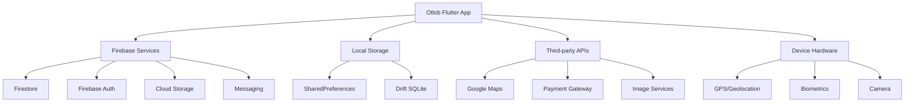
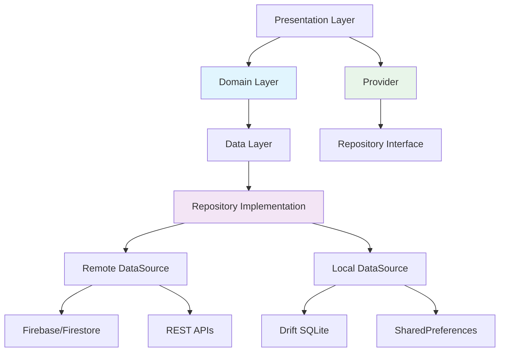

# Otlob Architecture Document - BMAD-METHOD Format
**Version:** 2.1 (BMAD-METHOD Architecture)
**Date:** October 7, 2025
**Status:** Active - Brownfield Implementation

---

## Executive Summary

This document defines the architectural foundation for the Otlob Flutter mobile application using Clean Architecture patterns, optimized for BMAD-METHOD development workflows.

**Architecture Philosophy:**
- **Clean Architecture** with clear separation of concerns
- **BmAD-Agent-Driven**: Designed for specialized AI agent collaboration (Analyst→PM→Architect→SM→Dev→QA)
- **Test-First**:Built for comprehensive testing and quality assurance
- **Scalable**: Supports growth from MVP to enterprise-level features

---

## System Context



---

## Clean Architecture Layers

### Domain Layer (Business Logic)
**Purpose:** Core business rules, independent of frameworks and external dependencies

#### Components:
- **Entities:** Pure Dart business objects (`User`, `Restaurant`, `CartItem`, etc.)
- **Repositories:** Abstract interfaces defining data contracts
- **Use Cases:** Application-specific business logic (optional, kept simple per BMAD design)

#### Code Structure:
```
lib/features/{feature}/domain/
├── entities/
│   ├── user.dart
│   ├── restaurant.dart
│   └── cart_item.dart
└── repositories/
    └── restaurant_repository.dart
```

#### Design Principles:
- ✅ Zero Flutter dependencies
- ✅ Framework-agnostic
- ✅ Highly testable
- ✅ Immutable entities using Freezed

### Data Layer (Data Management)
**Purpose:** Handle data persistence, external API communication, and data transformation

#### Components:
- **Models:** JSON-serializable DTOs for API communication
- **Data Sources:** Remote (Firebase/API) and Local (SQLite/SharedPreferences)
- **Repository Impl:** Concrete implementation of domain repository interfaces

#### Code Structure:
```
lib/features/{feature}/data/
├── models/
│   ├── user_model.dart
│   └── restaurant_model.dart
├── datasources/
│   ├── restaurant_remote_datasource.dart
│   └── restaurant_local_datasource.dart
└── repositories/
    └── restaurant_repository_impl.dart
```

#### Design Principles:
- ✅ Implements domain repository contracts
- ✅ Handles data transformation (Model ↔ Entity)
- ✅ Manages caching and offline strategies
- ✅ Converts exceptions to domain failures

### Presentation Layer (UI & State)
**Purpose:** User interface components and state management logic

#### Components:
- **Screens:** Full-page UI views
- **Widgets:** Reusable UI components
- **Providers:** Riverpod state management

#### Code Structure:
```
lib/features/{feature}/presentation/
├── screens/
│   └── home_screen.dart
├── widgets/
│   └── restaurant_card.dart
└── providers/
    └── home_provider.dart
```

#### Design Principles:
- ✅ No business logic (delegated to domain)
- ✅ No direct data access (via repositories only)
- ✅ Stateless widgets with const constructors
- ✅ Riverpod for reactive state management

---

## State Management Architecture

### Riverpod Strategy
**BMAD-Optimized**: Designed for AI-assisted development with clear contracts

#### Provider Types by Use Case:

| Use Case | Provider Type | BMAD Agent Responsibility |
|----------|---------------|--------------------------|
| **API Data Fetching** | `AsyncNotifierProvider` | Dev Agent (with QA review) |
| **Local State** | `StateProvider` | Dev Agent |
| **Complex Business Logic** | `StateNotifierProvider` | Dev Agent |
| **Computed Values** | `Provider` | Dev Agent |
| **Stream Data** | `StreamProvider` | Dev Agent |

#### Example: API Data Provider
```dart
@riverpod
class RestaurantList extends _$RestaurantList {
  @override
  Future<List<Restaurant>> build(String location) async {
    final repository = ref.read(restaurantRepositoryProvider);
    return repository.getRestaurants(location);
  }

  // Dev Agent: Implement methods as needed
  Future<void> refresh() async {
    state = const AsyncValue.loading();
    state = await AsyncValue.guard(() async {
      final repository = ref.read(restaurantRepositoryProvider);
      return repository.getRestaurants('current_location');
    });
  }
}
```

---

## Data Flow Architecture



### Important Contracts

1. **Repository Interface** (Domain):
   ```dart
   abstract class RestaurantRepository {
     Future<Either<Failure, List<Restaurant>>> getRestaurants(String location);
     Future<Either<Failure, Restaurant>> getRestaurantById(String id);
   }
   ```

2. **Repository Implementation** (Data):
   ```dart
   class RestaurantRepositoryImpl implements RestaurantRepository {
     @override
     Future<Either<Failure, List<Restaurant>>> getRestaurants(String location) async {
       try {
         final models = await remoteDataSource.fetchRestaurants(location);
         final entities = models.map((m) => m.toEntity()).toList();
         return Right(entities);
       } on ServerException catch (e) {
         return Left(ServerFailure(e.message));
       }
     }
   }
   ```

3. **Provider** (Presentation):
   ```dart
   @riverpod
   class RestaurantNotifier extends _$RestaurantNotifier {
     @override
     Future<List<Restaurant>> build() async {
       return ref.read(restaurantRepositoryProvider).getRestaurants('default');
     }
   }
   ```

---

## Component Architecture

### Widget Component Patterns

#### 1. Screen Components
**Purpose:** Full-page user experiences
**Pattern:** ConsumerWidget + Riverpod watching
```dart
class HomeScreen extends ConsumerWidget {
  const HomeScreen({super.key});

  @override
  Widget build(BuildContext context, WidgetRef ref) {
    final restaurantsAsync = ref.watch(restaurantListProvider('Cairo'));

    return Scaffold(
      body: restaurantsAsync.when(
        data: (restaurants) => RestaurantList(restaurants: restaurants),
        loading: () => const LoadingIndicator(),
        error: (error, _) => ErrorView(message: error.toString()),
      ),
    );
  }
}
```

#### 2. Reusable Components
**Purpose:** Compositional UI building blocks
**Pattern:** StatelessWidget + Parameters
```dart
class RestaurantCard extends StatelessWidget {
  const RestaurantCard({
    super.key,
    required this.restaurant,
    this.onTap,
  });

  final Restaurant restaurant;
  final VoidCallback? onTap;

  @override
  Widget build(BuildContext context) {
    return Card(
      child: InkWell(
        onTap: onTap,
        child: Padding(
          padding: EdgeInsets.all(AppSpacing.md),
          child: Column(
            crossAxisAlignment: CrossAxisAlignment.start,
            children: [
              RestaurantImage(imageUrl: restaurant.imageUrl),
              SizedBox(height: AppSpacing.sm),
              RestaurantInfo(restaurant: restaurant),
              RestaurantRating(rating: restaurant.rating),
            ],
          ),
        ),
      ),
    );
  }
}
```

#### 3. State Widgets
**Purpose:** Manage local component state
**Pattern:** StatefulWidget + Riverpod for complex state
```dart
class FavoritesButton extends ConsumerWidget {
  const FavoritesButton({super.key, required this.restaurantId});

  final String restaurantId;

  @override
  Widget build(BuildContext context, WidgetRef ref) {
    // Watch global favorites state
    final isFavorite = ref.watch(
      favoritesProvider.select((favorites) =>
        favorites.contains(restaurantId)
      )
    );

    return IconButton(
      icon: Icon(
        isFavorite ? Icons.favorite : Icons.favorite_border,
        color: isFavorite ? Colors.red : null,
      ),
      onPressed: () => ref
        .read(favoritesProvider.notifier)
        .toggleFavorite(restaurantId),
    );
  }
}
```

---

## Dependency Injection Architecture

### Service Locator Pattern with Riverpod

#### 1. API Layer Configuration
```dart
@riverpod
Dio dioClient(DioClientRef ref) {
  final dio = Dio(BaseOptions(
    baseUrl: AppConfig.apiBaseUrl,
    connectTimeout: const Duration(seconds: 30),
    receiveTimeout: const Duration(seconds: 30),
  ));

  dio.interceptors.addAll([
    AuthInterceptor(ref),
    LoggingInterceptor(),
    ErrorInterceptor(ref),
  ]);

  return dio;
}
```

#### 2. Repository Dependencies
```dart
@riverpod
RestaurantRepository restaurantRepository(RestaurantRepositoryRef ref) {
  final remoteDataSource = ref.read(restaurantRemoteDataSourceProvider);
  final localDataSource = ref.read(restaurantLocalDataSourceProvider);
  final networkInfo = ref.read(networkInfoProvider);

  return RestaurantRepositoryImpl(
    remoteDataSource: remoteDataSource,
    localDataSource: localDataSource,
    networkInfo: networkInfo,
  );
}
```

#### 3. Data Source Dependencies
```dart
@riverpod
RestaurantRemoteDataSource restaurantRemoteDataSource(
  RestaurantRemoteDataSourceRef ref,
) {
  final dio = ref.read(dioClientProvider);
  return RestaurantRemoteDataSourceImpl(dio: dio);
}
```

---

## Testing Architecture

### Test Pyramid Strategy

```
     5%     _______
          / E2E   \
   15%   / Tests  \
        /_________\
  30%   / Widget \
       / Tests   \
      /__________\
 50%   / Unit    \
       / Tests   \
      /__________\
```

### Unit Test Coverage
**Domain Logic:** 80%+ Coverage Target
- Repository implementations
- Business logic
- Utility functions
- Data models

### Widget Test Coverage
**UI Components:** 70%+ Coverage Target
- Custom widgets
- State interactions
- Error states
- Loading states

### Integration Test Coverage
**Critical Flows:** 100% Coverage
- Authentication flow
- Order placement
- Restaurant discovery
- Cart management

### Example: Repository Testing
```dart
@GenerateMocks([RestaurantRemoteDataSource])
void main() {
  test('should return Restaurant list when API call succeeds', () async {
    // Arrange
    final mockRemote = MockRestaurantRemoteDataSource();
    final repository = RestaurantRepositoryImpl(remote: mockRemote);

    when(mockRemote.getRestaurants('Cairo'))
        .thenAnswer((_) async => [mockRestaurantModel]);

    // Act
    final result = await repository.getRestaurants('Cairo');

    // Assert
    expect(result, Right([restaurantEntity]));
    verify(mockRemote.getRestaurants('Cairo')).called(1);
  });
}
```

---

## Cross-Platform Architecture

### Platform-Specific Adaptations

#### Android (Primary Target)
- **Material Design 3:** Native Android design language
- **Biometrics:** Fingerprint/Face ID for authentication
- **Notifications:** Firebase Cloud Messaging
- **Payments:** Paymob integration via WebView
- **Location:** Google Play Services fused location

#### iOS (Secondary Target)
- **Cupertino Design:** iOS-first design adaptations
- **Face ID/Touch ID:** Native biometric authentication
- **Notifications:** APNs through Firebase
- **Payments:** Paymob integration (WebView)
- **Location:** Core Location framework

### Platform Abstraction Layer
```dart
abstract class PlatformService {
  Future<String> getDeviceId();
  Future<bool> authenticateBiometric();
  Future<Position> getCurrentPosition();
  Future<bool> requestPermission(PermissionType type);
}

class PlatformServiceImpl implements PlatformService {
  final DeviceInfoPlugin _deviceInfo = DeviceInfoPlugin();
  final LocalAuthentication _auth = LocalAuthentication();

  @override
  Future<String> getDeviceId() async {
    if (Platform.isAndroid) {
      final androidInfo = await _deviceInfo.androidInfo;
      return androidInfo.id;
    } else if (Platform.isIOS) {
      final iosInfo = await _deviceInfo.iosInfo;
      return iosInfo.identifierForVendor!;
    }
    throw UnsupportedError('Platform not supported');
  }
}
```

---

## Security Architecture

### Data Protection Strategy

#### 1. Authentication Security
- **Token Storage:** Encrypted shared preferences
- **Token Refresh:** Automatic background refresh
- **Session Management:** Automatic logout on inactivity

#### 2. API Security
- **HTTPS Only:** All API communications encrypted
- **Request Signing:** API key authentication
- **Rate Limiting:** Client-side rate limiting implementation

#### 3. Local Data Security
- **Sensitive Data:** Encrypted storage for payment info
- **Key Management:** Secure key generation and storage
- **Data Clearing:** Secure wipe on logout/uninstall

### Example: Authenticated API Calls
```dart
class AuthInterceptor extends Interceptor {
  final Ref ref;

  AuthInterceptor(this.ref);

  @override
  Future<void> onRequest(RequestOptions options, handler) async {
    final token = await SecureStorage.getAuthToken();
    if (token != null) {
      options.headers['Authorization'] = 'Bearer $token';
    }
    handler.next(options);
  }

  @override
  void onError(DioException err, handler) {
    if (err.response?.statusCode == 401) {
      // Token expired - redirect to login
      ref.read(authProvider.notifier).logout();
    }
    handler.next(err);
  }
}
```

---

## Scalability Architecture

### Modular Feature Structure
```
lib/features/
├── auth/           # Independent module
├── home/           # Independent module
├── cart/           # Independent module
├── favorites/      # Independent module
├── profile/        # Independent module
├── orders/         # Future module
└── payments/       # Future module
```

### Build-Time Code Generation
- **Freezed:** Immutable data classes
- **JsonSerializable:** Automatic JSON mapping
- **Riverpod:** Auto-generated providers

### Performance Optimization
- **Image Caching:** Intelligent caching strategies
- **List Virtualization:** Efficient large list rendering
- **Lazy Loading:** On-demand feature loading
- **Memory Management:** Proper disposal and cleanup

---

## Deployment Architecture

### Build Configurations

#### Development Environment
- **API Endpoint:** Firebase emulator suite
- **Logging:** Verbose logging enabled
- **Debug Tools:** Performance overlays enabled

#### Staging Environment
- **API Endpoint:** Staging Firebase project
- **Logging:** Info level logging
- **Analytics:** Staging analytics stream

#### Production Environment
- **API Endpoint:** Production Firebase project
- **Logging:** Error-only logging
- **Analytics:** Production analytics stream

### Build Variants
```yaml
# pubspec.yaml
flavors:
  development:
    app:
      name: "Otlob Dev"
  staging:
    app:
      name: "Otlob Staging"
  production:
    app:
      name: "Otlob"
```

### CI/CD Pipeline
```yaml
# .github/workflows/deploy.yml
jobs:
  test:
    runs-on: ubuntu-latest
    steps:
      - uses: actions/checkout@v4
      - uses: subosito/flutter-action@v2
      - run: flutter test --coverage
      - run: flutter build apk --flavor production

  deploy:
    needs: test
    runs-on: ubuntu-latest
    steps:
      - uses: actions/upload-artifact@v4
        with:
          name: apk
          path: build/app/outputs/flutter-apk/app-production-release.apk
```

---

## Quality Assurance Architecture

### BMAD-Optimized QA Gates

**Gate 1: Code Quality**
- Linting: No analysis errors
- Testing: 70%+ coverage
- Documentation: Public APIs documented

**Gate 2: Architecture Compliance**
- Clean Architecture layers respected
- Dependency injection correct
- State management patterns followed

**Gate 3: Security Review**
- No hardcoded secrets
- Secure data handling
- Privacy compliance checks

**Gate 4: Performance Baseline**
- App size within limits
- Startup time < 3 seconds
- Core flows < 2 seconds

### Automated QA Checks
```yaml
# analysis_options.yaml
analyzer:
  strong-mode:
    implicit-casts: false
    implicit-dynamic: false
  errors:
    missing_return: error
    missing_required_param: error
    unconditional_import_of_deferred_library: error
```

---

## Future Architecture Roadmap

### Phase 2: Backend Migration
- **Current:** Firebase Firestore
- **Target:** .NET Core API + PostgreSQL
- **Strategy:** Gradual migration with feature flags

### Phase 3: Microservices Architecture
- **User Service:** Authentication & Profile
- **Restaurant Service:** Business management
- **Order Service:** Transaction processing
- **Notification Service:** Real-time messaging

### Phase 4: Advanced Features
- **Real-time Updates:** WebSocket architecture
- **Offline-First:** Advanced caching strategies
- **Machine Learning:** Personalized recommendations
- **Multi-tenant:** White-label capabilities

---

**Architecture Owner:** BMAD-METHOD Architecture Team
**Last Updated:** October 7, 2025
**Next Review:** Monthly Architecture Reviews
